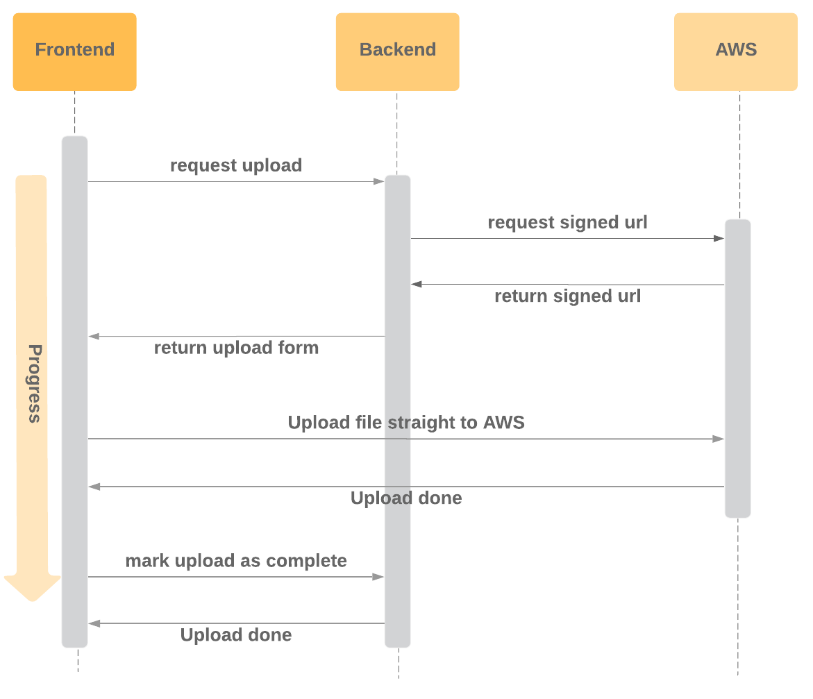

# Django S3 File Upload Client

[](https://travis-ci.com/dabapps/django-s3-file-upload-client)

Upload files from the browser to S3 - client side implementation (with redux integration)

For the server side implementation see [github.com/dabapps/django-s3-file-upload-server](https://github.com/dabapps/django-s3-file-upload-server)

## Installation

To install the package run:

```shell
npm i @dabapps/django-s3-file-upload -S
```

### Compatibility

You will also need polyfills for both `Promises` and `Symbols` if you wish to target older browsers.

## Usage

### How it works

The flow to be able to upload files from the browser straight to AWS is as follows.


This library abstracts away the process of chaining the three requests that the frontend needs to make to upload a file from the browser to S3:
1. Request upload from server
2. Upload file to AWS S3
3. Mark upload as complete on server

The implementation is specific to the endpoints setup in this repo [github.com/dabapps/django-s3-file-upload-server](https://github.com/dabapps/django-s3-file-upload-server) so be sure to have the backend configured accordingly.

### Redux integration

This library provides 3 functions that can be combined to handle uploading multiple files, and storing the results, errors, and loading states in redux.

#### createActionSet

This function simply creates an object with some keys that will be used internally to allow the action and reducer to communicate.

```ts
const UPLOAD_PROFILE_PHOTO = createActionSet('UPLOAD_PROFILE_PHOTO');
```

#### createFileUploadAction

This creates a [redux-thunk](https://github.com/reduxjs/redux-thunk) action that handles dispatching requests, and actions that track the loading states of the files, as well as the responses / errors.

```ts
const uploadProfilePhoto = createFileUploadAction(UPLOAD_PROFILE_PHOTO);
```

`createFileUploadAction` takes an action set, and an optional options object, and returns a `Promise<UploadData>` (see [Types](#types)).

Actions created with this function will not throw errors by default. This means that calling `.catch` on the returned promise will not be effective unless you utilize the following option...

Currently the options object only exists to allow you to provide a `shouldRethrow` function, which is called with any errors, and will cause the action to rethrow any errors if `true` is returned from `shouldRethrow`.

Once you've created your action you can then dispatch this from your store, or connected component e.g.

```ts
class MyComponent extends PureComponent<Props> {
  // ...
  private onSubmit = (data: FormData) => {
    this.props.uploadProfilePhoto([data.picture]);
  }
  // ...
}

export default connect(undefined, { uploadProfilePhoto })(MyComponent);
```

This takes an array of files. If you only have a single file to upload just provide an array containing that file.

You should prevent the user from attempting to upload the same set of, or additional files while the requests are in progress (as this will cause issues with the loading states). You can check the current loading state from the [reducer](#createFileUploadReducer), and disable your submit button.

#### createFileUploadReducer

This function is used to create a reducer for a specific set of file uploads.

DO NOT use the same reducer for uploading multiple sets of files unless you really know what you are doing.

```ts
const profilePhotoUpload = createFileUploadReducer(UPLOAD_PROFILE_PHOTO);
```

This can then be added to your store, and connected to React components to provide you with the `UploadState` (see [Types](#types)).

### Basic usage

The function `uploadFileToS3` is used internally by the other functions that integrate with redux. If you're not using redux, you can use this to upload individual files, and manually store the loading state, responses, and errors.

`uploadFileToS3` returns a `Promise` of type `Promise<UploadData>` (see [Types](#types)).

Let's say we have a form which contains a `file`, which we want to upload to S3 on submit, we can do the following:

```ts
import { UploadData, uploadFileToS3 } from '@dabapps/django-s3-file-upload';

interface FormData {
  file: File
}

const handleSubmit = (formData: FormData): Promise<UploadData> => {
  uploadFileToS3(formData.file)
};
```

The file should now be stored in `S3`, but isn't linked to any useful models (apart from `UploadedFile`) on the backend yet.

Say we have a `Llama` model on the backend and an action implemented on the frontend to `updateLlamaProfile`. We'll probably want to update the Llama profile with the new `file` after it's been stored in `S3`.

We can do this by chaining our functions:

```ts
import { UploadData, uploadFileToS3 } from '@dabapps/django-s3-file-upload';

import { updateLlamaProfile, displayError } from './path';

interface FormData {
  file: File
}

const handleSubmit = (formData: FormData) => {
  uploadFileToS3(formData.file)
    .then(({id}) => {
      updateLlamaProfile({
        llama_file: id
      })
    })
    .catch((error) => {
      displayError(error);
    });
};
```

### Types

The response type for each file upload:

```ts
interface UploadData {
  id: string;
  created: string;
  modified: string;
  complete_url: string;
  file: string;
  file_key: string;
  file_path: string;
  filename: string;
  upload_form: UploadForm;
}
```

Reducer state:

```ts
interface UploadState {
  loading: boolean;
  fileCount: number; // Total number of files to be uploaded
  inFlightCount: number; // Number of files being uploaded (but have not finished)
  completeCount: number;
  successCount: number;
  failureCount: number;
  data: undefined | ReadonlyArray<UploadData>;
  error: undefined | ReadonlyArray<unknown>;
}
```

## Code of conduct

For guidelines regarding the code of conduct when contributing to this repository please review [https://www.dabapps.com/open-source/code-of-conduct/](https://www.dabapps.com/open-source/code-of-conduct/)
